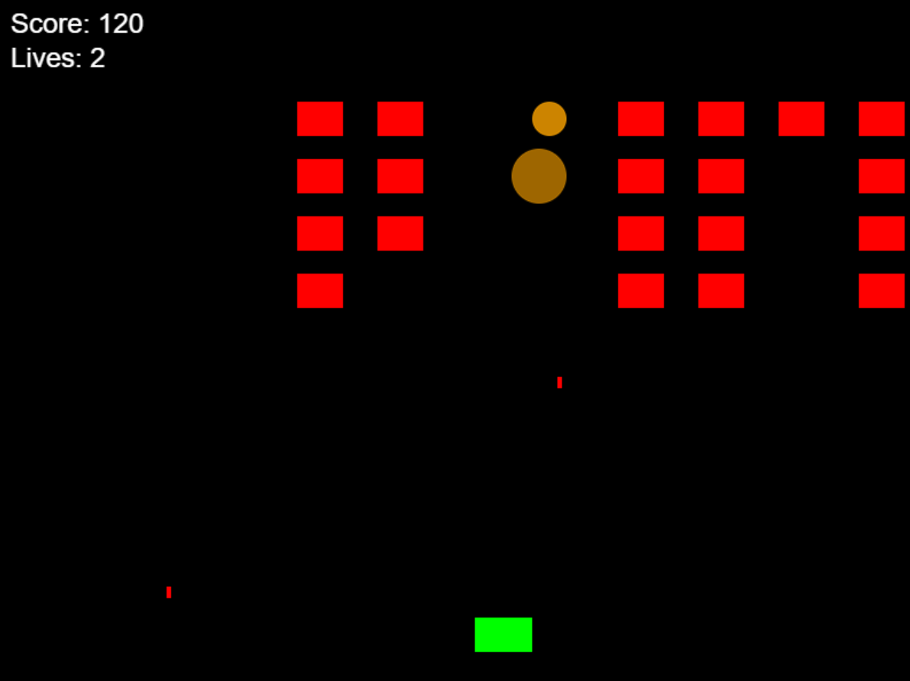

# Space Invaders Game

A TypeScript implementation of the classic Space Invaders arcade game using HTML5 Canvas.



## Features

- Player movement with arrow keys
- Shooting mechanics (spacebar to fire)
- Enemy waves with increasing difficulty
- Score tracking
- Lives system
- Explosion effects when enemies are hit
- Game over detection

## How to Play

1. Use **Left/Right Arrow** keys to move your ship
2. Press **Spacebar** to shoot bullets
3. Destroy all enemies to advance to the next level
4. Avoid enemy bullets and prevent enemies from reaching the bottom

## Installation & Running

1. Clone the repository
2. Install dependencies:
   ```bash
   npm install
   ```
3. Start the development server:
   ```bash
   npm run dev
   ```
4. Open your browser to the provided local server URL

## Controls

| Key        | Action           |
|------------|------------------|
| ← / →      | Move left/right  |
| Space      | Fire bullet      |

## Technical Details

- Built with TypeScript
- Uses Vite for development and bundling
- HTML5 Canvas for rendering
- No external dependencies (pure browser APIs)

## Future Improvements

- Add sound effects
- Implement high score system
- Add different enemy types
- Include power-ups
- Mobile touch controls

## License

MIT
